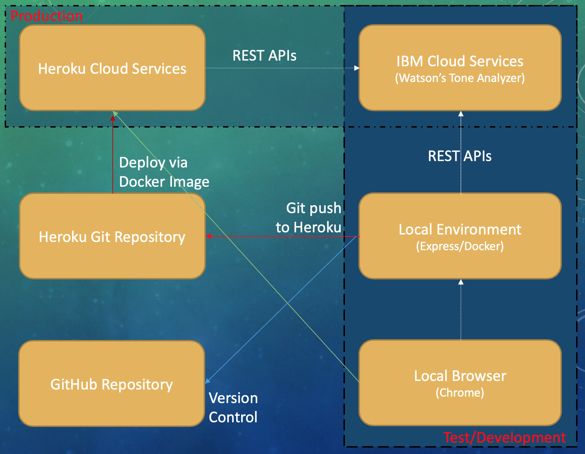

# Watson Assist

> Watson Assist is a state of the art web application that uses IBM Watson's linguistics analysis to detect fear, angry, joyous, sad, analytical, confident, and tentative tones that may be found in text. This service can be useful for writing a sales pitch or emails that convey a desired tone.


A working version of this application can be found **[here](https://watson-assist.herokuapp.com)**

___

## **Tools Used**

* **[Watson's Tone Analyzer](https://www.ibm.com/watson/services/tone-analyzer/)**
* **[IBM Cloud Platform](https://www.ibm.com/cloud/)**
* **[Heroku Cloud Platform](https://www.heroku.com/)**
* **[Node Package Manager](https://www.npmjs.com/)**
* **[Node JS](https://nodejs.org/en/)**
* **[Vue JS](https://vuejs.org/)**

___

## **Project Architecture**



## **Project Setup**

>The following instructions are for Mac OS.
>Project setup for Windows and Linux are unavailable.

___

## **Install Dependencies**

**Install Node and NPM**

``` bash
# Install Node and NPM via Homebrew:
brew install node

# Check to see if Node installed properly:
node -v

# Check to see if NPM installed properly:
npm -v
````

**Install IBM Cloud CLI**

``` bash
# Install via shell:
curl -fsSL https://clis.ng.bluemix.net/install/osx | sh

# Check to see if IBM Cloud CLI installed properly:
ibmcloud --version
```

**Install Heroku CLI**

``` bash
# Install via Homebrew:
brew install heroku/brew/heroku

# Check to see if Heroku CLI installed properly:
heroku --version
```

**Install Vue JS and Vue CLI**

``` bash
# Install via npm:
npm install -g vue

# Check to see if Vue installed properly:
vue --version
```

___


## Commission a Watson Tone Analyzer Web Service from IBM Cloud

* Create your own service **[here](https://www.ibm.com/watson/services/tone-analyzer/)** (**the lite plan is all that is needed**).
* Copy your service's API Key and URL (**you will need them later**).


___

## Clone the Watson Assist Repository

> This repository contains all the code needed to run this application. With the exception of one file which you will create below.

**Clone the repository:**

``` bash
# Clone the repo via git:
git clone https://github.com/kevtr0n/WatsonAssist.git
```

**Create a ```.env``` file in the project root:**

``` bash
# Change into the project directory:
cd WatsonAssist

# Create a .env file:
touch .env
```

**Inside the ```.env``` file, do the following:**

``` bash
# Create the following variables:
TONE_ANALYZER_API_KEY=YOUR_TONE_ANALYZER_API_KEY
TONE_ANALYZER_API_URL=YOUR_TONE_ANALYZER_API_URL
TONE_ANALYZER_VERSION_DATE=2017-09-21
```

## Serve Locally (with hot-reload/without backend connectivity)

``` bash
npm run serve
```

## Serve Locally (without hot-reload/with backend connectivity)

``` bash
# Comment out line 127 of WatsonAssist/src/store/store.ts
# Uncomment line 128
npm run build
node server.js
```

## Build Docker Image and Serve Locally

``` bash
# Builds a Docker image using the Dockerfile inside
docker build -t IMAGE_NAME .

# Serve Docker image on port 8080
docker run -it -p 8080:80 --rm --name INSTANCE_NAME IMAGE_NAME
```

## Deploy to Heroku

**Before your application can work on Heroku, you will need to add your environment variables to your Heroku project.**

Under the settings tab in your Heroku project you will need to click the button titled 'Reveal Config Vars'


Once there, you will need to add your three environment variables:

``` bash
TONE_ANALYZER_API_KEY=YOUR_TONE_ANALYZER_API_KEY
TONE_ANALYZER_API_URL=YOUR_TONE_ANALYZER_API_URL
TONE_ANALYZER_VERSION_DATE=2017-09-21
```


**Time to deploy!**

> Be sure that **line 127** of ```WatsonAssist/src/store/store.ts``` is uncommented and **line 128** is commented out for production.

``` bash
# Login to Heroku:
heroku login

# Initialize .git in project root:
git init
heroku git:remote -a YOUR_HEROKU_PROJECT_NAME

# Deploy your application:
npm run build
git add .
git commit -am "Initial commit."
git push heroku master

# Or use NPM script:
npm run deploy
```
